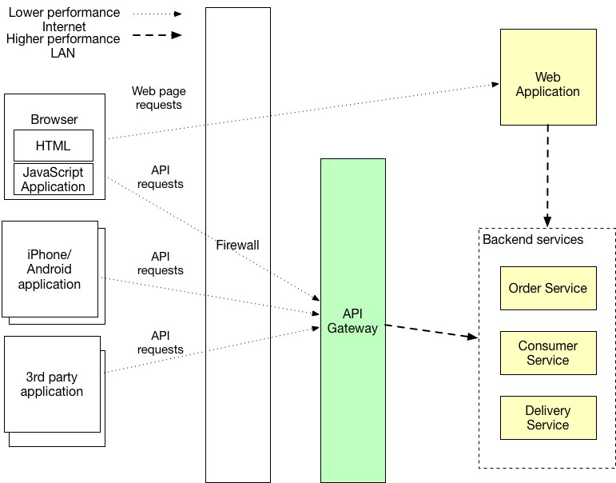
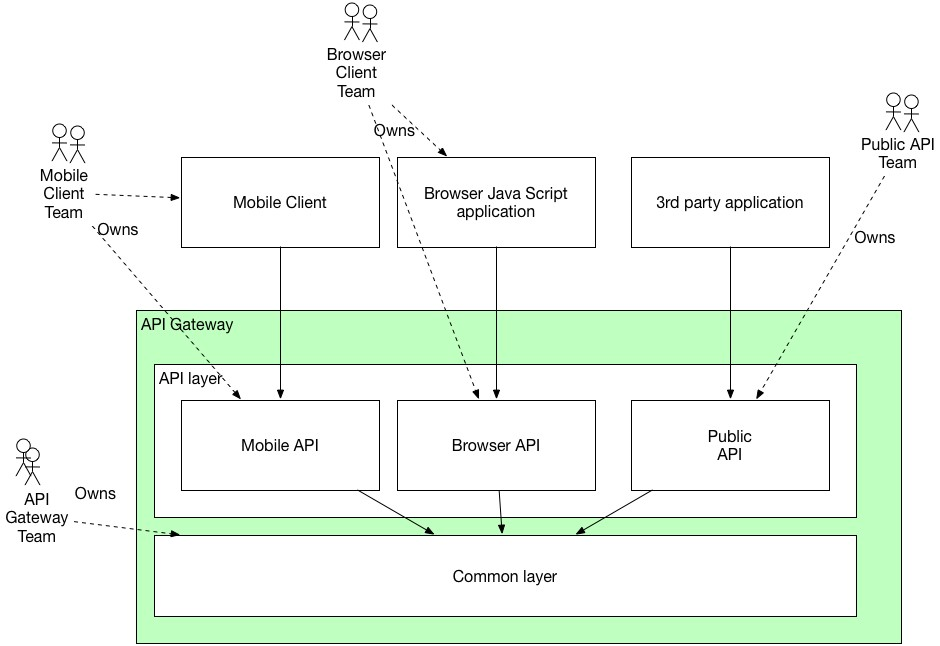
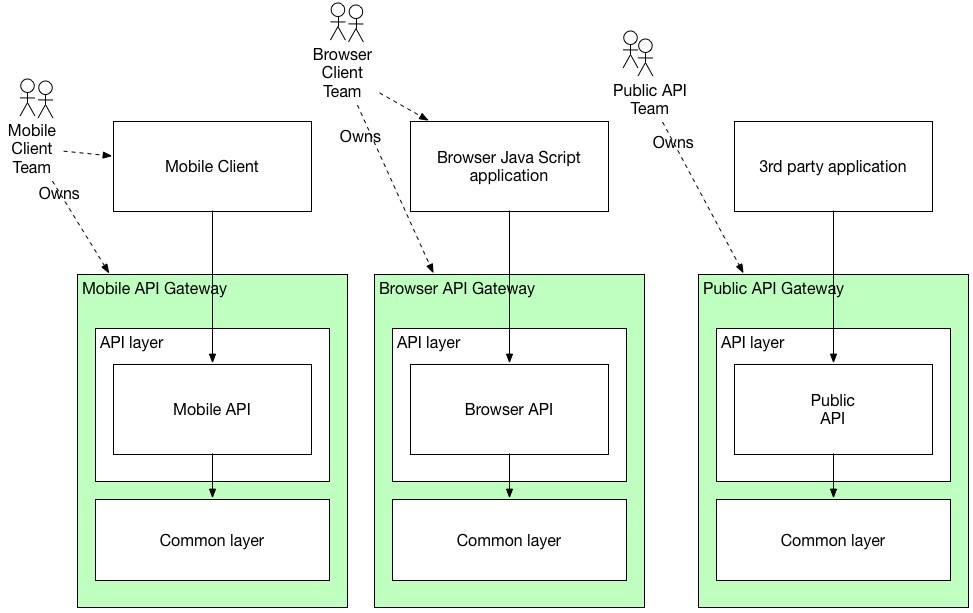

# Backend for frontend

---

## 缘起

客户端（Public API/Browser/Mobile）通过多次向微服务发起请求完成业务流程的缺点是众所周知的，因此在微服务的体系中我们需要在内网与外网间添加一层用于后台微服务的API聚合，此实现即为API网关。

API网关负责请求路由、API组合以及协议转换。 来自外部客户端的所有API请求首先都会到达API网关。 API网关将一些请求路由到适当的服务。 网关使用API组合模式并调用多个服务并汇总结果来处理其他请求。 它还可能会在服务友好的客户端友好协议（如restful）与客户端不友好协议（WebService、grpc?、thrift）之间进行转换。

* 请求路由：API网关的关键功能之一是请求路由。 API网关通过将请求路由到相应的服务来实现一些API操作。 当API网关接收到请求时，它会查询路由映射，该路由映射指定将请求路由到的服务。 路由映射例如可以将HTTP方法和路径映射到服务的HTTP URL。 此功能与Web服务器（如NGINX）提供的反向代理功能相同。

* API组合：API网关通常做的不只是反向代理， 它还可能会使用API组合来实现一些API操作。 我们想象下直接将微服务暴露在外网的情形：客户端需要完成单个业务流程，此业务流程需要横跨多个不同的微服务（包括界面刷新）从而导致数十次请求，在这个过程中我们后台服务器浪费了几倍的吞吐资源，因此我们需要在客户端和后台微服务之间添加一个API组合的层，降低请求频次。

* 协议转换：客户端通常要求使用restful风格设计的接口，但后台微服务或出于团队协作的考虑，或处于性能原因，可能会采用其它的RPC设计（如RPC风格的http、grpc以及thrift等）

* 实现边缘功能：如上图所示，微服务是依据业务的纵向分离，API网关将微服务隔离在内网并作为整个系统的功能设计暴露在公网，因此我们可以将一些边缘功能实现在API网关上，如：

  1. 身份验证——验证发出请求的客户端的身份
  2. 授权——验证客户端是否有权执行特定操作
  3. 速率限制——限制特定客户端和/或所有客户端每秒允许多少个请求
  4. 缓存——缓存响应以减少对服务的请求数量
  5. 指标收集——收集有关API使用情况的指标以用于热点或者计费分析
  6. 请求记录——记录请求日志

## BFF

Backendf For Frontend属于特化的API网关，其相对于API网关多了一个职责——针对客户端（前端）进行API组合设计。虽然API网关有API组合的职责，但其一般是比较范用的设计。如不同的客户端（如Browser和IOS）请求时，移动端由于界面的考虑其实并不需要Browser那么多的数据，甚至移动端的业务操作会相对弱化避免太过复杂，在此情况下移动端使用和Browser一样的API设计就不太合适了。

如果所有客户端的API都实现在一个API网关上往往会导致API网关过重，甚至团队协作间产生冲突（如移动端需要添加新的API，却连同Browser端的代码都需要一起发布），甚至会导致管理上的困难（依据**谁开发谁拥有**的原则，假如所有客户端团队都在同一个API网关上进行开发，则所有客户端团队都需要对同一个代码仓库负责；如果由单一的团队（如API网关团队甚至是后台团队）负责API网关的开发，则其必须了解所有客户端的API需求，并且要和所有客户端团队联动响应，这是不太现实的，也是比较低效的），因此对应不同的客户端，会有不同的BFF。

因应客户端的需求而设计的BFF，其最佳实践是由对应的客户端团队负责，而且考虑到边缘功能的通用，理想情况下最好使用相同的技术栈（如nodejs）。除了明确定义职责外，BFF模式还具有其他好处：API模块彼此隔离，从而提高了可靠性。 一个行为不当的API不会轻易影响其他API。 BFF模式还提高了可观察性，因为不同的API模块是不同的过程。 BFF模式的另一个好处是每个API都是独立可伸缩的。 BFF模式减少了启动时间，因为每个API网关都是一个更小、更简单的应用程序。以下两张图展示了BFF在团队中的演化：

